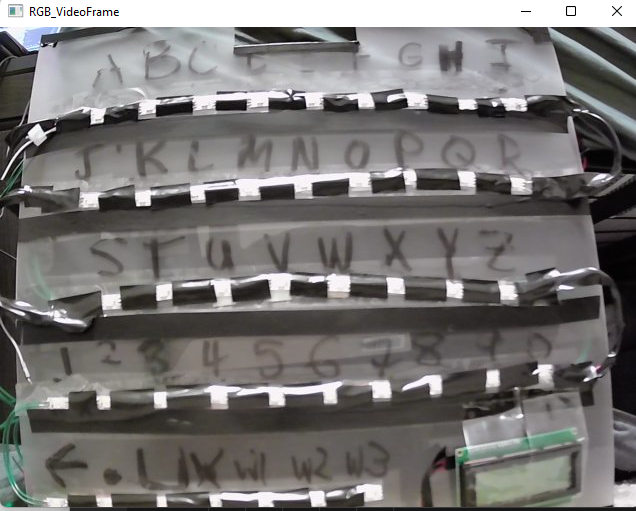

# Smartboard

Code for using a Smart Letterboard for communication

**Table of contents**

- [Smartboard](#smartboard)
  - [What does it do](#what-does-it-do)
  - [Installation Instructions](#installation-instructions)
  - [Usage Instructions](#usage-instructions)
  - [References](#references)

## What does it do

The Smart Letterboard enables communicating with others without the use of voice or hand movement. A laser pointer is attached to one's ear or glasses. The laser pointer than points at the letter on the letter board. A camera sends the image to a computer (in our case it was the [Jetson Xavier NX SBC](https://www.nvidia.com/en-us/autonomous-machines/embedded-systems/jetson-xavier-nx/)). The computer processes the image to figure out which letter is being pointed at. This uses the [laser tracker code](https://github.com/sisaha9/python-laser-tracker) developed here. Credit to @bradmontgomery for the initial implementation. Once we figure out the letter, we use the [Happy Transformers](https://happytransformer.com/) library to predict the top 3 words (either completion if we are in the process of communicating a word or prediction of new words if we have completed). This is then voiced using the [gTTS](https://gtts.readthedocs.io/en/latest/) (Google Text To Speech) library. The letter and predictions are also sent to the Arduino so they can be communicated to the users via LED strips on each letter and an LCD screen that displays the sentence being built and predictions
  
## Installation Instructions

We need to install the following packages

```
sudo apt install libopenblas-dev
sudo apt install ffmpeg
sudo apt install mpg321
```

Then we need to install Torch. If this is on Desktop use https://pytorch.org/ for installation instructions. If on a Jetson use https://docs.nvidia.com/deeplearning/frameworks/install-pytorch-jetson-platform/index.html

Finally we need to install the following pip libraries

```
pip3 install git+https://github.com/sisaha9/transformers.git@add_prefix
pip3 install git+https://github.com/sisaha9/happy-transformer.git@add_prefix
pip3 install pyserial
pip3 install gTTS
pip3 install opencv-python
```
Note the source installations of the `transformers` and `happy-transformer` library. These are needed as the forks have some additions that support word completion capabilities

## Usage Instructions

1. Clone this repository
```
git clone https://github.com/sisaha9/smartboard.git
```
Once cloned, switch directories to inside this repository

2. Follow the [installation instructions](#installation-instructions)

3. Flash the Arduino code in `smartboard_arduino`

4. Run `python3 laser_tracker/laser_tracker/laser_tracker.py`

5. Position your USB camera so that the letter board is centered in view



6. Stop running the laser tracker. Now run `./run.sh` (Note that you still need to be connected to internet for the gTTS library to operate)

7. It takes around 10-30 seconds to initialize (depending on hardware) but once it does the letter tracking works and you will be able to use the Smartboard as intended

## References

- This work relies on @bradmontgomery 's laser tracker code: https://github.com/sisaha9/python-laser-tracker
- This work relies on the Happy Transformer library for word prediction: https://happytransformer.com
- This work relies on the gTTS library for text to speech: https://gtts.readthedocs.io/en/latest